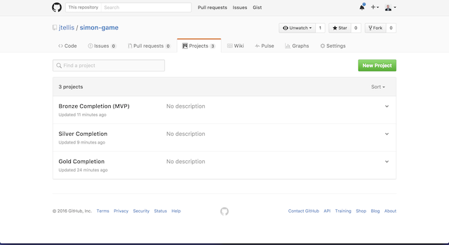
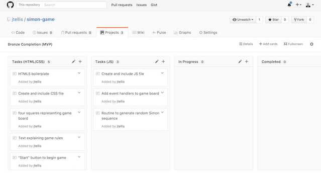
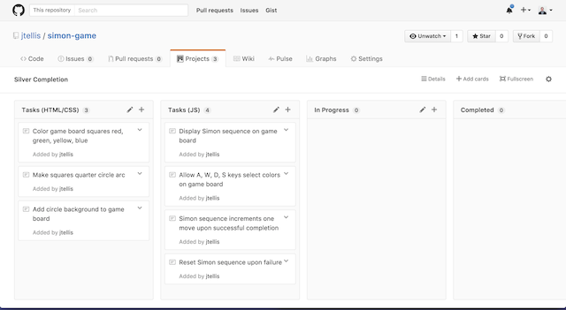
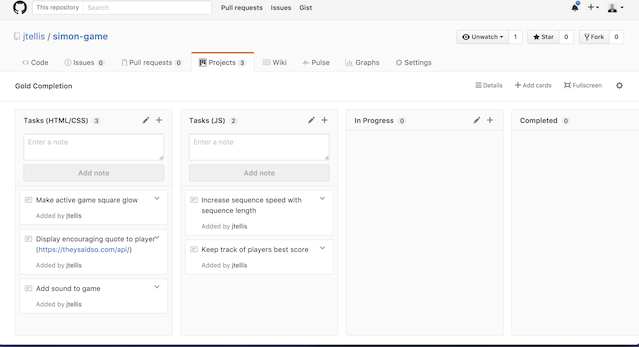

# Simon
### A modern web rendition of the _classic_ Simon game

## Playing the game

This repository is deployed through [GitHub Pages](https://pages.github.com/). You can play the game [here](https://jtellis.github.io/simon-game/). You can also Clone _(please Fork, so I can Pull all your great additions and fixes!)_ this repository and play Simon locally without any additional dependencies.

## Background

### Planning

#### Bronze, Silver and Gold
I based my planning phase on the strategy of [Bronze, Silver and Gold](https://github.com/ga-wdi-lessons/bronze-silver-gold) completion goals.
* Bronze completion is the minium viable product
* Silver is the work-in-progress version showing a more fleshed out product
* Gold is the fully completed product with possible reach features and other improvements

To organize this process, I used the [Projects](https://help.github.com/articles/tracking-the-progress-of-your-work-with-projects/) feature of my GitHub repository. Creating a Bronze, Silver and Gold project in the [Projects section](https://github.com/jtellis/simon-game/projects) of the repository, I was able to group and categorize specific tasks together to form a comprehensive outline of steps needed to create the deliverable completion levels in order. In the future I will be creating [user stories](https://github.com/ga-wdi-lessons/agile/#user-stories-how-do-we-figure-out-our-mvp) as an additional planning phase to drive task creation. I also plan to use [Issues](https://guides.github.com/features/issues/) in addition to Projects to plan and develop my projects.

#### Completion Levels in Projects

#### Bronze (MVP) Completion Level Planning

#### Silver Completion Level Planning

#### Gold Completion Level Planning

### Validation and Best Practices
#### HTML5
The markup for this project validates as HTML5 by [Validator.nu (X)HTML5 Validator](https://html5.validator.nu/).

#### CSS
The Cascading Style Sheets for this project validates as CSS level 3 by [W3C CSS Validation Service](https://jigsaw.w3.org/css-validator/).

### Resources
#### jQuery
I originally began this project intending to use no external libraries. However, as I progressed, the appeal to use [jQuery](https://jquery.com/) to attach event handlers to multiple elements at once using the jQuery object method [on](http://api.jquery.com/on/) grew. I decided to refactor my JavaScript code,  implementing jQuery. This resulted in more concise and readable code. The game did not suffer any noticeable performance loss from using this library.

#### CSS Animations
I relied on the [Using CSS animations](https://developer.mozilla.org/en-US/docs/Web/CSS/CSS_Animations/Using_CSS_animations) documentation provided by [MDN](https://developer.mozilla.org/) to create game board visual effects.

### Notes

#### JavaScript _Sleep_
I used [this](https://davidwalsh.name/javascript-sleep-function) method to implement various delays in the game for visual effects. Simon requires a way to display a sequence at variable speed, as well as the ability to delay user input after certain events; I needed a very reusable way to delay or "sleep." The Promise method [then](https://developer.mozilla.org/en-US/docs/Web/JavaScript/Reference/Global_Objects/Promise/then) also improved the readablity and flow of code.
